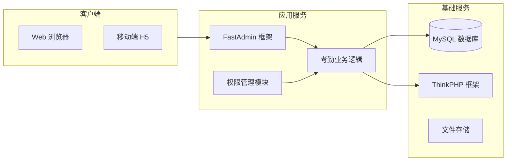
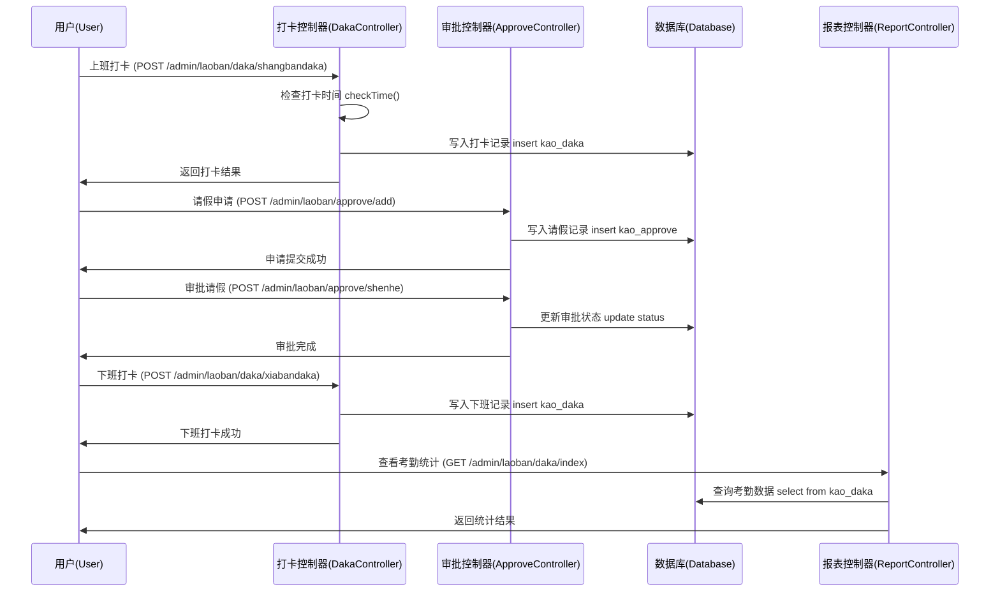

# 🗂 开发文档（考勤管理系统）

> **开发文档的核心目标：**
> 
> 1. 知识传递 - 新人看文档就能快速理解系统和上手开发
> 2. 规范统一 - 统一格式和结构，提高团队协作效率
> 3. 降低交接成本 - 人员变动时减少依赖，实现快速交接
> 4. 打通协作链路 - 开发、运维、测试共享信息，避免孤岛
> 5. 可追溯审计 - 记录变更历史，便于问题回溯

---

## 0. 文档控制

| 字段 | 内容 | 说明 |
| --- | --- | --- |
| 文档编号 | DEV-ATTENDANCE-STD | 统一编号，`DEV-系统-类型` |
| 版本 | v1.0 | 语义化版本 |
| 生效日期 | 2025-01-11 | 批准后生效 |
| 审批人(Approver) | 技术负责人 | 有发布/标准批准权 |
| 复审周期 | 每 6 个月 | 到期必须复审 |
| 文档密级 | 内部/受限 | 访问范围 |
| 记录保存年限 | ≥ 3 年 | 版本与评审记录保留 |

## 1. 基本信息

| 字段 | 内容 | 填写指引 |
| --- | --- | --- |
| **系统名称** | 考勤管理系统（Attendance Management System） | 系统全称 + 常用简称 |
| **系统 ID** | SYS-HR-001 | 公司唯一编号，例如 `SYS-部门缩写-序号` |
| **负责人（Owner）** | 技术负责人 | 技术负责人，负责开发文档更新 |
| **备份人（Backup）** | 项目经理 | 负责人的替补 |
| **代码仓库** | `本地项目目录` | GitHub/GitLab 仓库地址 |
| **文档最后更新** | 2025-01-11 | 文档实际修改日期 |

---

## 2. 系统概述

| 项目 | 内容 | 填写指引 |
| --- | --- | --- |
| **一句话简介** | 基于FastAdmin框架开发的考勤管理系统，支持员工打卡、请假审批、日报月报等完整的考勤管理功能。 | 用 1-2 句话概述系统作用 |
| **主要功能** | - 员工打卡管理（上班/下班/抽查打卡）- 请假申请与审批流程- 考勤组与班次管理- 日报月报统计- 考勤数据查询与分析 | 列出 3~5 个主要功能 |
| **核心亮点 / 技术特性** | 基于FastAdmin快速开发框架、支持多种打卡方式、灵活的考勤规则配置、完整的审批流程 | 可选，突出与其他系统的区别 |

---

## 3. 系统架构（落地版）

### 3.1 系统组成与交互



**说明：**

- **FastAdmin 框架**：基于ThinkPHP5.1的快速开发框架
- **考勤业务逻辑**：打卡、请假、审批等核心业务
- **权限管理模块**：基于Auth的权限控制系统
- **基础服务**：MySQL数据库、ThinkPHP框架、文件存储

---

### 3.2 模块说明表

> 用于快速定位功能 → 目录 → 文件

| 模块 | 功能说明 | 主要目录 | 关键入口文件/类 | 备注 |
| --- | --- | --- | --- | --- |
| 考勤管理 | 打卡记录、考勤统计 | `/application/admin/controller/laoban` | `Daka.php` / `Daka.php` | 核心打卡功能 |
| 请假审批 | 请假申请、审批流程 | `/application/admin/controller/laoban` | `Approve.php` / `Approve.php` | 包含审批状态管理 |
| 考勤配置 | 考勤组、班次设置 | `/application/admin/controller/kaoqin` | `Attendance.php` / `Attendanceshift.php` | 考勤规则配置 |
| 日报月报 | 工作汇报、统计报表 | `/application/admin/controller/laoban` | `Ribao.php` / `Yuebao.php` | 员工工作记录 |
| 用户管理 | 员工信息、权限管理 | `/application/admin/controller` | `auth/Admin.php` / `user/User.php` | 用户权限控制 |

---

### 3.3 入口索引（Top 10 常改功能）

> 用于快速定位到具体方法/路由，建议由 Swagger/脚本自动生成

| 功能 | 路由/方法 | 文件位置 | 备注 |
| --- | --- | --- | --- |
| 上班打卡 | `POST /admin/laoban/daka/shangbandaka` | `/application/admin/controller/laoban/Daka.php:564` | 上班打卡逻辑 |
| 下班打卡 | `POST /admin/laoban/daka/xiabandaka` | `/application/admin/controller/laoban/Daka.php:726` | 下班打卡逻辑 |
| 抽查打卡 | `POST /admin/laoban/daka/chouchadaka` | `/application/admin/controller/laoban/Daka.php:643` | 抽查打卡功能 |
| 请假申请 | `POST /admin/laoban/approve/add` | `/application/admin/controller/laoban/Approve.php:281` | 员工请假申请 |
| 请假审批 | `POST /admin/laoban/approve/shenhe` | `/application/admin/controller/laoban/Approve.php:377` | 审批通过 |
| 请假拒绝 | `POST /admin/laoban/approve/jujue` | `/application/admin/controller/laoban/Approve.php:394` | 审批拒绝 |
| 考勤查询 | `GET /admin/laoban/daka/index` | `/application/admin/controller/laoban/Daka.php:222` | 考勤记录查询 |
| 日报提交 | `POST /admin/laoban/ribao/add` | `/application/admin/controller/laoban/Ribao.php:257` | 员工日报 |
| 月报统计 | `GET /admin/laoban/yuebao/index` | `/application/admin/controller/laoban/Yuebao.php:214` | 月报统计 |
| 考勤组配置 | `GET /admin/kaoqin/attendance/index` | `/application/admin/controller/kaoqin/Attendance.php:62` | 考勤组管理 |

---

### 3.4 主流程（最常用用户路径）

用一张图展示系统的核心业务流程，帮助新人快速理解功能运行顺序，并定位到相关代码模块



---

**阅读说明：**

- **U（用户 User）** → 员工进行打卡、请假等操作
- **D（打卡控制器 DakaController）** → 处理打卡相关业务逻辑
- **A（审批控制器 ApproveController）** → 处理请假申请和审批
- **DB（数据库 Database）** → 存储考勤数据
- **R（报表控制器 ReportController）** → 生成统计报表

---

## 4. 技术栈

| 组件 | 版本 | 用途 | 填写提示 |
| --- | --- | --- | --- |
| PHP | 7.1+ | 后端开发语言 | 主开发语言与框架 |
| MySQL | 5.7+ | 数据存储 | 数据库类型 |
| ThinkPHP | 5.1 | 框架基础 | 基础框架 |
| FastAdmin | 1.4.0 | 快速开发框架 | 基于ThinkPHP的快速开发框架 |
| Bootstrap | 3.x | 前端UI框架 | 前端界面框架 |
| jQuery | 3.x | 前端JS库 | 前端交互 |
| AdminLTE | 2.x | 后台模板 | 后台管理界面 |

---

### 4.1 第三方依赖与许可

| 依赖 | 版本 | 用途 | 许可 | 风险/替代 |
| --- | --- | --- | --- | --- |
| FastAdmin | 1.4.0 | 快速开发框架 | 商业许可 | 基于ThinkPHP5.1 |
| ThinkPHP | 5.1 | 基础框架 | Apache 2.0 | 稳定版本 |
| Bootstrap | 3.x | 前端UI | MIT | 兼容性好 |

## 5. 开发环境搭建

> 详见：《应用部署说明 - 考勤管理系统》文档

---

## 6. 接口文档（核心示例）

> 完整 API 文档参考：FastAdmin框架文档

---

## 7. 数据库结构（核心表）

### 7.1，表字段解析

| 表名 | 字段 | 类型 | 说明 |
| --- | --- | --- | --- |
| kao_daka | **id** | INT | 主键，自增 |
|  | **admin_id** | INT | 员工ID |
|  | **dakatime** | INT | 打卡日期（时间戳） |
|  | **createtime** | INT | 具体打卡时间（时间戳） |
|  | **typelist** | ENUM('0','1','2') | 打卡类型：0=上班，1=抽查，2=下班 |
|  | **ischidao** | ENUM('0','1') | 是否迟到：0=否，1=是 |
|  | **iszaotui** | ENUM('0','1') | 是否早退：0=否，1=是 |
|  | **isqueqin** | ENUM('0','1') | 是否缺勤：0=否，1=是 |

### 7.2 索引与约束（最小必要集）

| 名称 | 类型 | 定义 | 作用 |
| --- | --- | --- | --- |
| **idx_admin_date** | INDEX | `(admin_id, dakatime)` | 常用：查某人某天记录 |
| **idx_typelist** | INDEX | `(typelist)` | 常用：按打卡类型查询 |
| **idx_createtime** | INDEX | `(createtime)` | 常用：按时间排序 |

---

### 7.3（可选）DDL 模板（直接可用）

```sql
CREATE TABLE `kao_daka` (
  `id` int(10) unsigned NOT NULL AUTO_INCREMENT COMMENT '编号',
  `admin_id` int(10) NOT NULL COMMENT '员工名称',
  `dakatime` int(10) NOT NULL COMMENT '打卡年月日',
  `createtime` int(10) NOT NULL COMMENT '具体打卡时间',
  `typelist` enum('0','1','2') NOT NULL DEFAULT '0' COMMENT '打卡类型:0=上班打卡,1=抽查打卡,2=下班打卡',
  `year` int(5) NOT NULL COMMENT '年',
  `month` int(5) NOT NULL COMMENT '月',
  `ischidao` enum('0','1') NOT NULL DEFAULT '0' COMMENT '是否迟到:0=否,1=是',
  `iszaotui` enum('0','1') NOT NULL DEFAULT '0' COMMENT '是否早退:0=否,1=是',
  `isqueqin` enum('0','1') NOT NULL DEFAULT '0' COMMENT '是否缺勤:0=否,1=是',
  PRIMARY KEY (`id`),
  INDEX idx_admin_date (admin_id, dakatime),
  INDEX idx_typelist (typelist),
  INDEX idx_createtime (createtime)
) ENGINE=InnoDB DEFAULT CHARSET=utf8mb4;
```

---

### 7.4 30 秒勾选（上线前）

- [ ]  时间统一存 **时间戳**，展示按格式化转换
- [ ]  打卡记录**防重复**提交
- [ ]  迟到早退判断逻辑正确
- [ ]  数据库字段注释完整

---

## 8. 业务规则

---

| **规则描述** | **说明** | **触发条件 / 备注** |
| --- | --- | --- |
| 打卡时间限制 | 上班打卡不能早于规定时间，下班打卡不能早于规定时间 | 根据考勤组配置的startbefore和endbefore参数 |
| 迟到早退判断 | 超过规定时间打卡视为迟到，早于规定时间下班视为早退 | 根据考勤组配置的startmiss和endmiss参数 |
| 请假审批流程 | 员工提交请假申请 → 管理员审批 → 审批结果通知 | 审批状态：0=申请中，1=已通过，2=已拒绝 |
| 考勤组配置 | 不同员工组可以设置不同的考勤规则 | 通过auth_group_access关联考勤组 |
| 日报限制 | 每天只能提交一次日报，重复提交会覆盖之前的记录 | 按员工ID和日期去重 |

---

**使用说明**

1. **规则描述**：用动词或名词短语开头，简明描述规则核心。
2. **说明**：明确规则具体做法或数据来源。
3. **触发条件/备注**（可选）：写清楚规则生效的前提条件、特殊情况或配置入口。

---

## 9. 测试与质量

| 项目 | 内容 | 填写提示 |
| --- | --- | --- |
| 测试环境地址 | [本地开发环境](http://localhost) | 测试服务器访问地址 |
| 自动化测试 | `/tests` 目录 | 测试代码位置 |
| 测试账号 | `admin` / `123456` | 测试用例账号 |
| 回归测试 checklist | [测试文档链接] | 回归测试步骤或清单链接 |

---

## 10. 版本历史

| 版本 | 日期 | 更新内容 | 负责人 |
| --- | --- | --- | --- |
| v1.0 | 2025-01-11 | 初始版本上线 | 技术负责人 |

---

## 11. 关联资源

| 资源类型 | 链接 | 填写提示 |
| --- | --- | --- |
| 需求文档 | [链接] | 系统需求说明书 |
| UI 设计稿 | [链接] | 原型/设计图 |
| 部署文档 | [链接] | 对应 Deployment Guide |
| 应急手册 | [链接] | 对应 Runbook |

---

## 12. 安全与合规

| **项目** | **要求/措施** | **说明** |
| --- | --- | --- |
| 常见风险防护 | SQL 注入、越权访问 | 必须做参数校验、权限检查 |
| 安全实践 | 代码审查、依赖库扫描 | 发现漏洞立即修复 |
| 日志审计 | 打卡/审批操作写入日志 | 日志中敏感字段需脱敏 |
| 数据分级 | 员工信息=敏感个人信息 | 日志不记录原文 |
| 权限矩阵 | Employee / Manager / Admin | 严格按角色分配权限 |
| 认证机制 | Session / Cookie | 在打卡、数据访问中必须校验身份 |

## 13. 常见问题 & 故障排查

已知问题/坑

| 问题现象 | 可能原因 | 解决方案 |
| --- | --- | --- |
| 打卡时间判断错误 | 考勤组配置不正确 | 检查考勤组和班次配置 |
| 请假审批状态异常 | 数据库状态字段不一致 | 检查审批状态更新逻辑 |
| 考勤统计不准确 | 打卡记录缺失或重复 | 检查打卡记录完整性 |

---

## 14. 核心代码示例

### 14.1 打卡逻辑核心代码

```php
// 上班打卡逻辑
public function shangbandaka(){
    $params['admin_id'] = $_SESSION['think']['admin']['id'];
    $day_time = strtotime(date("Y-m-d"));
    
    // 检查是否已打卡
    $daka_info = Db::name('daka')->where([
        'dakatime'=>$day_time,
        'typelist'=>"0",
        'admin_id'=>$params['admin_id']
    ])->find();
    
    if($daka_info){
        $this->error("你今天已经打过出勤卡了");
    }
    
    // 获取考勤配置
    $user_group_id = Db::name('auth_group_access')
        ->where(['uid'=>$params['admin_id']])->find();
    
    $attendance = Db::name('attendance a')
        ->field('b.*')
        ->join('kao_attendanceshift b','a.attendanceshift_id=b.id')
        ->where('FIND_IN_SET(:value, a.group_ids)', 
                ['value' => $user_group_id['group_id']])
        ->find();
    
    if(!$attendance){
        $this->error("还没有设置对应的考勤组跟班次");
    }
    
    // 判断是否迟到
    $now_dakatime = time();
    $zuiduochidao = strtotime(date("Y-m-d")." ".date("H:i:s",$attendance['starttime']))+60*$attendance['startmiss'];
    
    $params['ischidao'] = "0";
    if($now_dakatime > $zuiduochidao){
        $params['ischidao'] = "1";
    }
    
    // 保存打卡记录
    $result = $this->model->allowField(true)->save($params);
    if ($result === false) {
        $this->error(__('No rows were inserted'));
    }
    $this->success("打卡成功！");
}
```

### 14.2 请假审批核心代码

```php
// 审批通过
public function shenhe($ids){
    $update_data = array(
        'pushadmin_id' => "1",
        'shenhetime' => time(),
        'status' => "1"
    );
    $result = Db::name('approve')->where(['id'=>$ids])->update($update_data);
    
    if($result){
        $this->success("审核通过");
    }
}

// 审批拒绝
public function jujue($ids){
    $update_data = array(
        'pushadmin_id' => "1",
        'shenhetime' => time(),
        'status' => "2"
    );
    $result = Db::name('approve')->where(['id'=>$ids])->update($update_data);
    
    if($result){
        $this->success("请假已拒绝");
    }
}
```

---

## 15. 部署说明

### 15.1 环境要求

- PHP 7.1+
- MySQL 5.7+
- Apache/Nginx
- FastAdmin 1.4.0

### 15.2 安装步骤

1. 下载FastAdmin框架
2. 配置数据库连接
3. 导入数据库结构
4. 配置虚拟主机
5. 设置文件权限

### 15.2 配置文件

```php
// application/database.php
return [
    'type' => 'mysql',
    'hostname' => '127.0.0.1',
    'database' => 'kaoqinguanli',
    'username' => 'kaoqinguanli',
    'password' => 'rBtKsXTdeS6cWG5c',
    'prefix' => 'kao_',
];
```

---

## 16. 维护指南

### 16.1 日常维护

- 定期备份数据库
- 监控系统性能
- 检查日志文件
- 更新安全补丁

### 16.2 故障处理

- 数据库连接问题
- 打卡功能异常
- 审批流程阻塞
- 报表统计错误

---

**文档结束**

> 本文档基于实际项目分析生成，包含了考勤管理系统的核心功能、技术架构、数据库设计、业务规则等关键信息，可作为新人入职培训和系统维护的参考资料。

